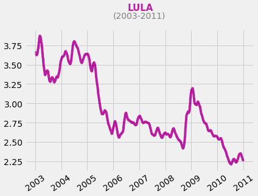
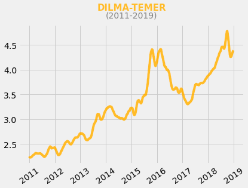
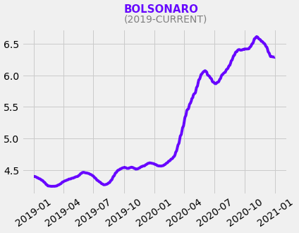
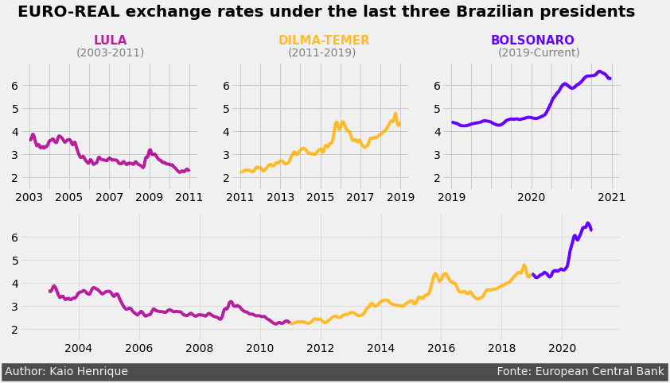

# Euro-Real Exchange Rate
 O presente projeto foi feito como trabalho para a disciplina IMD1123 TÓPICOS ESPECIAIS EM INTELIGÊNCIA COMPUTACIONAL “D” ministrada pelo professor Ivanovitch Silva. O projeto foi realizado baseado no curso [Storytelling Data Visualization](https://app.dataquest.io/course/storytelling-information-design) no qual é disponibilizado um dataset com informações coletadas diariamente sobre a taxa de câmbio entre o euro e várias moedas entre os anos de 1999 à 2021.
 
 Por meio da utilização de conceitos absorvidos em aula como código limpo, boas práticas de escrita de código e teste qualidade de código, foi criado um jupyter notebook [](https://github.com/Kaioh95/euro-real-exchange-rate/blob/main/euro_real.ipynb) para visualização dos dados do câmbio de euro para real durante os mandatos dos últimos 3 presidentes brasileiros, depois foi gerado um script [](https://github.com/Kaioh95/euro-real-exchange-rate/blob/main/euro_real.py) para verificar o score de qualidade de código por meio do pylint. 
 
 Em seguinda o script [](https://github.com/Kaioh95/euro-real-exchange-rate/blob/main/euro_real_st.py) foi adaptado para ser executado no streamlit para montar um dashboard para visualização dos dados.
 
 ## Tools
 Para instalar as bibliotecas necessárias no seu ambiente de desenvolvimento, basta executar os seguintes comandos:
 
 ```sh
 pip install pandas
 ```
 ```sh
 pip install pylint
 ```
 ```sh
 pip install streamlit
 ```
 É recomendado usar o Anaconda, pois a maioria das bibliotecas necessárias já estão instaladas no ambiente de desenvolvimento. Para verificar o score no pylint, execute a seguinte comando: 
 
 ```sh
 pylint nome_do_arquivo.py
 ```
 e para abrir o dashboard no streamlit localmente, basta executar este comando:
 
 ```sh
 streamlit run euro_real_st.py
 ```
 
 ## Results
 <center></center>
 <center></center>
 <center></center>
 <center></center>
 
 ## Video
 A seguir o vídeo onde é mostrado os resultados da análise.
 [youtube](https://youtu.be/MYLwL_Bdplo)
